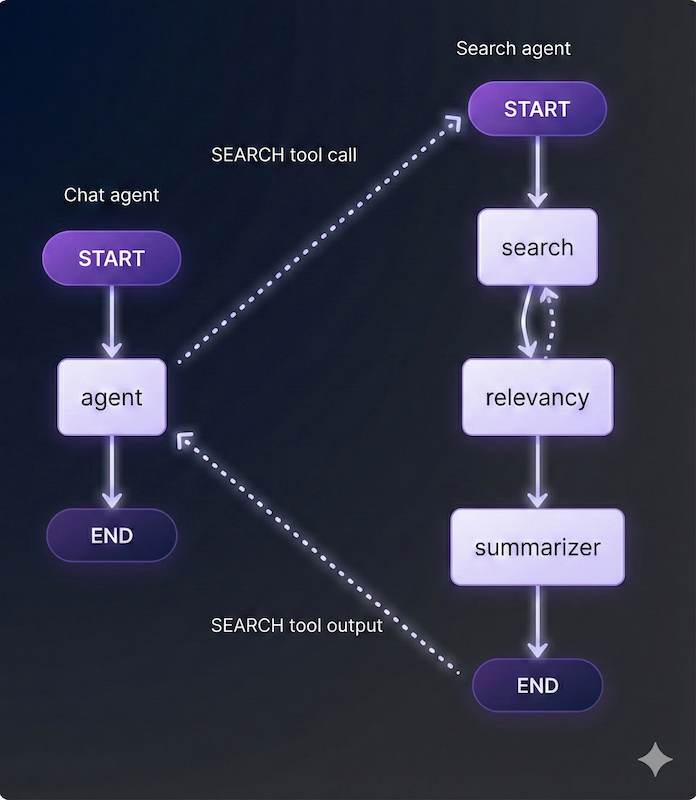

# Enterprise RAG Agent

A production-grade RAG-based AI Agent deployed on Azure, utilizing a multi-agent orchestrator to provide high-fidelity answers from internal enterprise documents.



## Architecture & Decision Log

The system handles the complexity of "internal policy documents" which often contain tables and nuanced logic that simple vector search misses.

| Decision | Selection | Why not the alternative? |
| --- | --- | --- |
| **Orchestration** | **LangGraph** | RAG requires **cycles** (looping). Graphs allow for reflection and "re-searching" if initial results are poor. |
| **LLM** | **gpt-4o-mini** | Balanced cost-efficiency with high reasoning capability. |
| **Parsing** | **Azure AI Doc Intelligence** | `prebuilt-layout` model accurately extracts tables and preserves header hierarchy. |
| **Search** | **Azure AI Search (Hybrid)** | Hybrid (Vector + Semantic Rerank) ensures both conceptual and literal matches are found. |

## The Search Strategy

We implemented a **Looping/Reflective pattern** in the Search Agent to guarantee quality.

1.  **Search:** The agent performs an initial retrieval.
2.  **Reflect:** A dedicated node analyzes the retrieved chunks against the query.
3.  **Loop:** If results are insufficient, the agent **rewrites the query** and searches again (max 3 iterations).
4.  **Summarize:** Once relevant data is found, it is condensed into a final answer.

## Tech Stack

*   **Language:** Python 3.12 (managed via `uv`).
*   **Orchestration:** LangGraph, LangChain.
*   **Cloud (Azure):** Azure OpenAI, Azure AI Search, Azure Document Intelligence.
*   **API:** FastAPI.

## Setup & Deployment

### Prerequisites
*   [uv](https://github.com/astral-sh/uv) (The only package manager you need)

### 1. Install Dependencies
```bash
uv sync
```

### 2. Environment Configuration
Create a `.env` file in the root directory:

```ini
# Azure OpenAI
AZURE_OPENAI_API_KEY=your_key
AZURE_OPENAI_ENDPOINT=your_endpoint
AZURE_OPENAI_API_VERSION=2024-02-15-preview

# Azure AI Search
AZURE_SEARCH_SERVICE_ENDPOINT=your_search_endpoint
AZURE_SEARCH_ADMIN_KEY=your_admin_key

# Azure Document Intelligence
AZURE_DOC_INTEL_ENDPT=your_doc_intel_endpoint
AZURE_DOC_INTEL_KEY=your_doc_intel_key
```

### 3. Run the API
```bash
uv run main.py
# Server running at http://0.0.0.0:8000
```

## Docker Deployment

Build and run the containerized application.

```bash
# Build the image
docker build -t rag-agent .

# Run container (passing .env file)
docker run -p 8000:8000 --env-file .env rag-agent
```

## Future Scope
*   **Persistent Database:** Integration of a persistent store (e.g., PostgreSQL/CosmosDB) for user profiles and thread history.
*   **Graph RAG:** Integrate knowledge graphs to capture complex entity relationships.
*   **Hierarchical RAG:** Implement hierarchical indexing for better reasoning over large document corpuses and long-distance context.
*   **Thread List:** Manage and retrieve past conversation threads.
*   **Streaming:** Implement streaming responses for lower perceived latency.
*   **Frontend:** Add a user-friendly Chat UI.
*   **Document Upload:** Allow users to upload documents directly via the UI/API.
